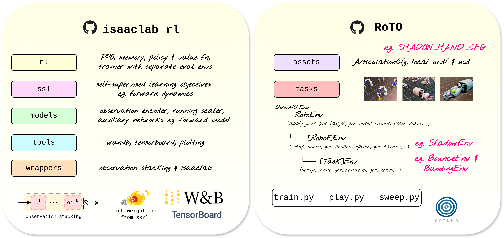

# RoTO: Robot Tactile Olympiad
RoTO is a **reinforcement learning benchmark environment** designed to standardise and promote future research in tactile-based manipulation. The environments are designed to cover a wide range of tactile interactions (sparse=Find, intermittent=Bounce, and sustained=Baoding). We will continue to add more environments and strongly welcome contributions of cool new envs 🤗

<div style="text-align: center;">
    
</div>

## ✨ Overview



We split the paper code across two repositories. Imagine the typical RL loop: you can think of `isaaclab_rl` as the agent, and `roto` as the environment. We did this for modularity, in case you want to use your own RL repository instead of ours (there will be some integration to achieve this but happy to help).

`isaaclab_rl`: The motto of this repo is _"doing good RL with Isaac Lab as painlessly as possible"_. We wrote this very lightweight repo to better handle multimodal dictionary observations (`tactile`, `proprioception`, `gt` (ground-truth), `pixels`), observation stacking and associated memory management, and integrated self-supervision. Many existing libraries did not provide support for doing robust RL research (correct evaluation metrics, distinct train/evaluation envs, integrated hyperparameter optimisation). These are well established norms in the RL research community, but are not yet consistently present in RL+robotics research, which we want to encourage 🚀

`roto`: This repo just contains the robot configurations and task definitions. We take advantage of class inheritance to heavily reduce repeated code. `RotoEnv` is a child of `DirectRLEnv`, and sets up basic functions to perform joint position control of a robot and reset it. `[Robot]Env` is a child of `RotoEnv`, defining robot-specific functions that do not change task-to-task, e.g. the proprioceptive observation key. Finally, `[Task]Env` defines task-specific functions such as setting up the environment, 


## 🛠️ Installation

1. Install Isaac Lab (recommend [pip installation](https://isaac-sim.github.io/IsaacLab/main/source/setup/installation/isaaclab_pip_installation.html#))
2. Install [isaaclab_rl](https://github.com/elle-miller/isaaclab_rl) as a local editable package
```
git clone git@github.com:elle-miller/isaaclab_rl.git
cd isaaclab_rl
pip install -e .
```
3. Clone this repository
```
git clone git@github.com:elle-miller/roto.git
```
---

## 🏃 Usage
Mostly the same as default Isaac Lab arguments, except need to specify an `agent_cfg` yaml file.

### Training
Here is how you would train a Find agent just with RL, a Bounce agent with RL + Tactile Reconstruction, and a Baoding agent with RL + Forward Dynamics.
```
python train.py --task Find --num_envs 4196 --headless --seed 1234 --agent_cfg rl_only_pt
python train.py --task Bounce --num_envs 4196 --headless --seed 1234 --agent_cfg tac_recon
python train.py --task Baoding --num_envs 4196 --headless --seed 1234 --agent_cfg full_dynamics
```

### Sweeping
Here are all the sweeps run in the paper. Same setup as `train.py`, but with an additional `--study` name argument.
```
python sweep.py --task Find --num_envs 4196 --headless --seed 1234 --agent_cfg rl_only_pt --study find_rl_only_pt
python sweep.py --task Find --num_envs 4196 --headless --seed 1234 --agent_cfg full_recon --study find_full_recon
python sweep.py --task Find --num_envs 4196 --headless --seed 1234 --agent_cfg tac_recon --study find_tac_recon
python sweep.py --task Find --num_envs 4196 --headless --seed 1234 --agent_cfg full_dynamics --study find_full_dynamics
python sweep.py --task Find --num_envs 4196 --headless --seed 1234 --agent_cfg tac_dynamics --study find_tac_dynamics

python sweep.py --task Bounce --num_envs 4196 --headless --seed 1234 --agent_cfg rl_only_pt --study bounce_rl_only_pt
python sweep.py --task Bounce --num_envs 4196 --headless --seed 1234 --agent_cfg full_recon --study bounce_full_recon
python sweep.py --task Bounce --num_envs 4196 --headless --seed 1234 --agent_cfg tac_recon --study bounce_tac_recon
python sweep.py --task Bounce --num_envs 4196 --headless --seed 1234 --agent_cfg full_dynamics --study bounce_full_dynamics
python sweep.py --task Bounce --num_envs 4196 --headless --seed 1234 --agent_cfg tac_dynamics --study bounce_tac_dynamics

python sweep.py --task Baoding --num_envs 4196 --headless --seed 1234 --agent_cfg rl_only_pt --study baoding_rl_only_pt
python sweep.py --task Baoding --num_envs 4196 --headless --seed 1234 --agent_cfg full_recon --study baoding_full_recon
python sweep.py --task Baoding --num_envs 4196 --headless --seed 1234 --agent_cfg tac_recon --study baoding_tac_recon
python sweep.py --task Baoding --num_envs 4196 --headless --seed 1234 --agent_cfg full_dynamics --study baoding_full_dynamics
python sweep.py --task Baoding --num_envs 4196 --headless --seed 1234 --agent_cfg tac_dynamics --study baoding_tac_dynamics
```

### Playing
To play with the viewer:
```
python play.py --task Bounce --agent_cfg rl_only_pt --num_envs 1 --headless --checkpoint paper_data/checkpoints/bounce_pt.pt
```
To generate a video:
```
python play.py --task Bounce --agent_cfg rl_only_pt --num_envs 1 --checkpoint paper_data/checkpoints/bounce_pt.pt --video
```
---
## 📊 Benchmark Results

Please see the paper. Note that the environments in this repo have been improved since the paper:
- Removed unnecessary dense rewards (time in air for Bounce, distance rewards for Baoding)
- Explicitly added joint control errors to the proprioceptive observation
- Fixed joint velocity normalisation

To run the paper checkpoints in the original environments, please... **TODO**.

---
## Data

The data in the paper is available.....**TODO**.

---

## 📧 Contact

For any questions, issues, or collaborations, please feel free to reach out 😀

- Maintainer: Elle Miller
- Email: elle.miller@ed.ac.uk
- Project Website: https://elle-miller.github.io/tactile_rl

This project is licensed under the MIT License - see the LICENSE file for details.

---
## 📄 Citation

If you use this benchmark environment in your academic or professional research, please cite the following work:

```
@inproceedings{miller2025tactilerl,
  author    = {Miller, Elle and McInroe, Trevor and Abel, David and Mac Aodha, Oisin and Vijayakumar, Sethu},
  title     = {Enhancing Tactile-based Reinforcement Learning for Robotic Control},
  journal   = {NeurIPS},
  year      = {2025},
}
```
---
## TODO

`RotoEnv` inherits from `DirectRLEnv`
- _configure_gym_env_spaces
- _pre_physics_step
- _apply_action sets joint pos targets (with moving average)
- _get_observations
- _reset_robot(env_ids, joint_pos_noise) resets robot joint pos
- _compute_intermediate_values(env_ids) computes normalised joint pos/vel

`${Robot}$Env` inherits from `RotoEnv`
- FrankaEnv, ShadowEnv
- _setup_scene
- _get_proprioception
- _get_tactile
- _compute_intermediate_values
- _get_dones with null termination and timeout truncation

`${Task}$Env` inherets from `${Robot}$Env`
- _get_gt
