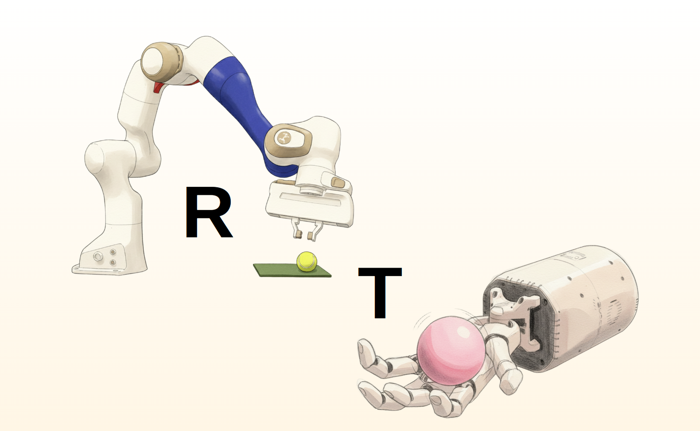
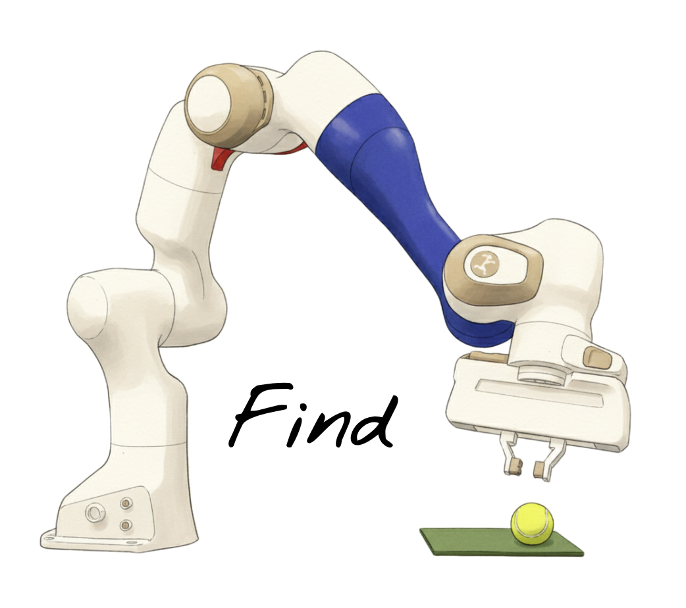
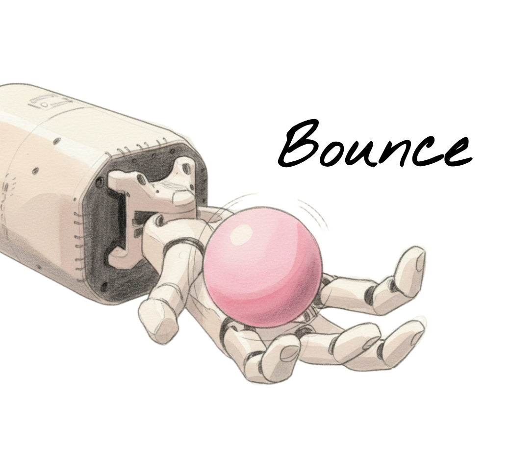
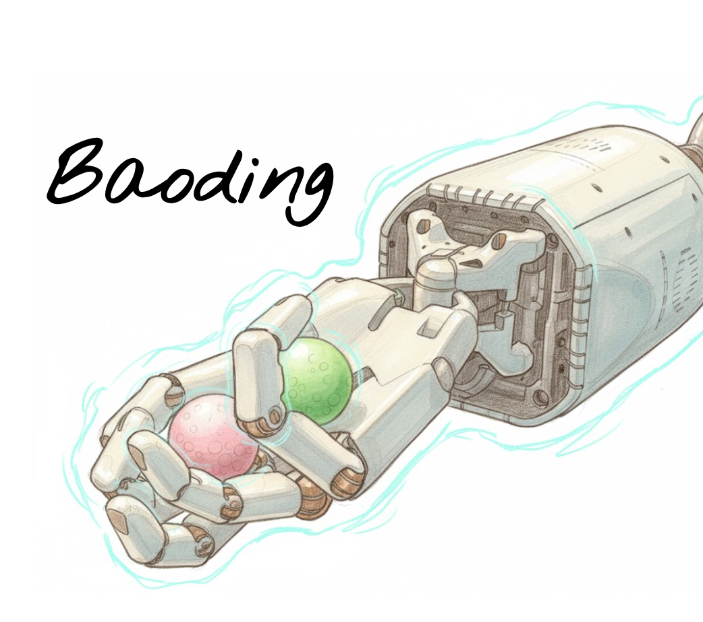

# RoTO: Robot Tactile Olympiad
RoTO is a **reinforcement learning benchmark environment** designed to standardise and promote future research in tactile-based manipulation. It is introduced in detail in [Enhancing Tactile-based RL for Robotic Control](https://elle-miller.github.io/tactile_rl/) (NeurIPS 2025).  The environments are designed to cover a wide range of tactile interactions: sparse (Find), intermittent (Bounce), and sustained (Baoding). We will continue to add more environments and strongly welcome contributions 🤗



## ✨ Overview


We split the paper code across two repositories. Imagine the typical RL loop: you can think of `isaaclab_rl` as the agent, and `roto` as the environment. We did this for modularity, in case you want to use your own RL repository instead of ours (there will be some integration to achieve this but happy to help).

`isaaclab_rl`: The motto of this repo is _"doing good RL with Isaac Lab as painlessly as possible"_. We started from the [skrl](https://github.com/Toni-SM/skrl) library and made significant changes to better handle multimodal dictionary observations, observation stacking and associated memory management, and integrated self-supervision. Many existing libraries did not provide support for doing robust RL research (correct evaluation metrics, distinct train/evaluation envs, integrated hyperparameter optimisation). These are well established norms in the RL research community, but are not yet consistently present in RL+robotics research, which we want to encourage 🚀

`roto`: This repo just contains the robot configurations and task definitions. We take advantage of class inheritance to heavily reduce repeated code. `RotoEnv` is a child of `DirectRLEnv`, and sets up basic functions to perform joint position control of a robot and reset it. `[Robot]Env` is a child of `RotoEnv`, defining robot-specific functions that do not change task-to-task, e.g. the proprioceptive observation key. Finally, `[Task]Env` defines task-specific functions such as setting up the environment, rewards, and episode resets.


## 🤖 Environments

The agents are all joint position controlled. Franka has 9 joints, Shadow has 20 actuated joints.

| Environment | Description | Observations | Rewards | Resets |
| :---: | :--- | :--- | :--- | :--- |
|  | The agent must locate a fixed ball on a plate as quickly as possible. | Proprioception + 2 binary contacts | Distance reward from end-effector to ball | Timestep limit |
|  | The agent must bounce a ball as many times as possible within 10s. | Proprioception + 17 binary contacts | Small airtime reward + bounce bonus | Timestep limit, ball falls |
|  | The agent must rotate two small balls around each other without letting them  drop. | Proprioception + 17 binary contacts | Small distance reward to ball target + successful rotation bonus | Timestep limit, ball falls |

## 🛠️ Installation

1. Install Isaac Lab (recommend [pip installation](https://isaac-sim.github.io/IsaacLab/main/source/setup/installation/isaaclab_pip_installation.html#))
2. Install [isaaclab_rl](https://github.com/elle-miller/isaaclab_rl) as a local editable package
```
git clone git@github.com:elle-miller/isaaclab_rl.git
cd isaaclab_rl
pip install -e .
```
3. Install `roto` as a local editable package
```
git clone git@github.com:elle-miller/roto.git
cd roto
pip install -e .
```
4. Test the installation by playing a trained agent in the viewer or saving a video. Note that the viewer playback is much slower than real-time.
```
python scripts/play.py --task Baoding --num_envs 512 --agent_cfg memory --checkpoint readme_assets/checkpoints/baoding_memory.pt
python scripts/play.py --task Baoding --num_envs 512 --agent_cfg memory --video --video_length 1200 --headless --checkpoint readme_assets/checkpoints/baoding_memory.pt
```
The video should pop up in a `./videos` folder and look like this:


You can find more trained checkpoints in the [roto_paper_results](https://github.com/elle-miller/roto_paper_results) repository.


## 🏃 Usage
Mostly the same as default Isaac Lab setup. The only breaking change is that a given task is not linked to a cfg file. The cfgs must be defined in the task `__init__.py` and specified as an `agent_cfg` argument.

We provide 3 environments x 7 cfgs, corresponding to the paper
```
gym.register(
    id="Baoding",
    entry_point="tasks.shadow.baoding:BaodingEnv",
    disable_env_checker=True,
    kwargs={
        "env_cfg_entry_point": baoding.BaodingCfg,
        "default_cfg": baoding_default_cfg,
        "rl_only_p": baoding_rl_only_p,
        "rl_only_pt": baoding_rl_only_pt,
        "tac_recon": baoding_tactile_recon,
        "full_recon": baoding_full_recon,
        "forward_dynamics": baoding_forward_dynamics,
        "tac_dynamics": baoding_tactile_dynamics,
        "tac_dynamics": baoding_tactile_dynamics,
    }
)
```
### Training
Here is how you would train a Find agent just with RL, a Bounce agent with RL + Tactile Reconstruction, and a Baoding agent with RL + Forward Dynamics.
```
python train.py --task Find --num_envs 4196 --headless --seed 1234 --agent_cfg rl_only_pt
python train.py --task Bounce --num_envs 4196 --headless --seed 1234 --agent_cfg tac_recon
python train.py --task Baoding --num_envs 4196 --headless --seed 1234 --agent_cfg forward_dynamics
```

### Sweeping
We use `opunta` for integrated hyperparameter optimisation. The command is the same as for `train.py`, but with an additional `--study` name argument. You can specify the pruner, number of trials, number of warm up steps etc. I recommend [this blogpost](https://araffin.github.io/post/hyperparam-tuning/)  if you are new to sweeping :)
```
python sweep.py --task Find --num_envs 4196 --headless --seed 1234 --agent_cfg rl_only_pt --study find_rl_only_pt
python sweep.py --task Bounce --num_envs 4196 --headless --seed 1234 --agent_cfg tac_recon --study bounce_tac_recon
python sweep.py --task Baoding --num_envs 4196 --headless --seed 1234 --agent_cfg forward_dynamics --study baoding_forward_dynamics
```

### Playing
To play with the viewer (requires local Isaac Lab installation):
```
python play.py --task Bounce --agent_cfg rl_only_pt --num_envs 1 --headless --checkpoint paper_data/checkpoints/bounce_pt.pt
```
To generate a video:
```
python play.py --task Bounce --agent_cfg rl_only_pt --num_envs 1 --checkpoint paper_data/checkpoints/bounce_pt.pt --video
```

## 📊 Benchmark Results [in-progress]

Please see the paper. Note that the environments in this repo have been improved since the paper:
- Removed unnecessary dense rewards (time in air for Bounce, distance rewards for Baoding)
- Explicitly added joint control errors to the proprioceptive observation
- Fixed joint velocity normalisation

To run the paper checkpoints in the original environments, please... **TODO**.

## 📁 Data

The data in the paper (checkpoints, training logs, plot scripts) is available in the [roto_paper_results](https://github.com/elle-miller/roto_paper_results) repo.


## 📧 Contact

For any questions, issues, or collaborations, please feel free to post an issue/start a discussion/reach out.

- Maintainer: Elle Miller
- Project Website: https://elle-miller.github.io/tactile_rl

This project is licensed under the BSD-3 License.


## 🤗 Contributing
This is our plan for future additions, but we highly welcome community contributions and PRs!

- More environments
- Pixel observations (code exists just need to integrate)
- Observation augmentations (code exists just need to integrate)
- Integrate TacSL for high-resolution touch sensing when it becomes released: https://github.com/isaac-sim/IsaacGymEnvs/issues/244
- Provide transformer architectures
- Action chunking

## 📄 Citation

If you use this benchmark environment in your academic or professional research, please cite the following work:

```
@inproceedings{miller2025tactilerl,
  author    = {Miller, Elle and McInroe, Trevor and Abel, David and Mac Aodha, Oisin and Vijayakumar, Sethu},
  title     = {Enhancing Tactile-based Reinforcement Learning for Robotic Control},
  booktitle = {NeurIPS},
  year      = {2025},
}
```
