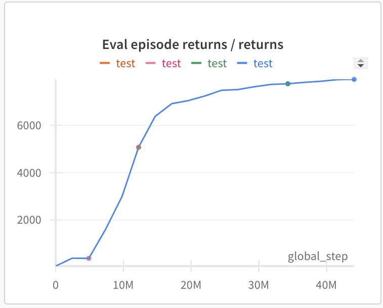
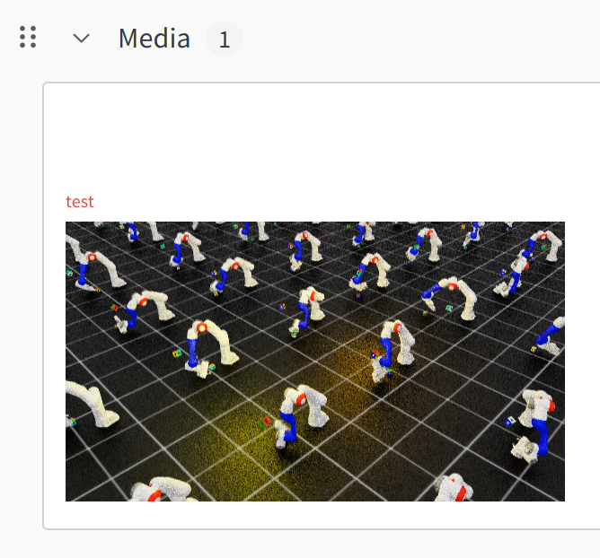

# isaaclab_rl_project


## Installation 

### 1. Follow install instructions [here](https://github.com/elle-miller/isaaclab_rl)

### 2. Create your own project repo

Two options:

a) Make a fork (this will be public) to track upstream changes

b) Make a private repo 

Create an empty unitialised [new repository](https://github.com/new) with your project name, then: 

```
git clone git@github.com:elle-miller/isaaclab_rl_project.git
mv isaaclab_rl_project my_cool_project_name
cd my_cool_project_name
git remote remove origin
git remote add origin git@github.com:yourusername/my_cool_project_name.git
git push -u origin main

# if you want to pull upstream changes
git remote add upstream git@github.com:elle-miller/isaaclab_rl_project.git
git pull upstream main
```

### 3. Setup wandb
Log into wandb if not already setup
```
wandb login
```
Update the config in `tasks/franka/agents/lift.yaml`
```
wandb_kwargs: {
    "entity": "%ENTER_YOURS",
    "project": "isaac_lab",
    "group": "franka_lift",
    "name": "test",
  }
```

### 4. Test everything is working OK
```
# the enable_cameras flag is to save progress videos on wandb (can disable via cfg)
python train.py --task Franka_Lift --num_envs 8192 --headless --seed 1234 --enable_cameras

# play checkpoint with viewer
python play.py --task Franka_Lift --num_envs 256 --checkpoint logs/franka/lift/.../checkpoints/best_agent.pt
```
In wandb, change the x-axis to `global_step`. The agent's progress should look like this, but there will be variation between PCs. The learning should also be reproducible for the same seed. 





### 5. Make your own environment

TODO
