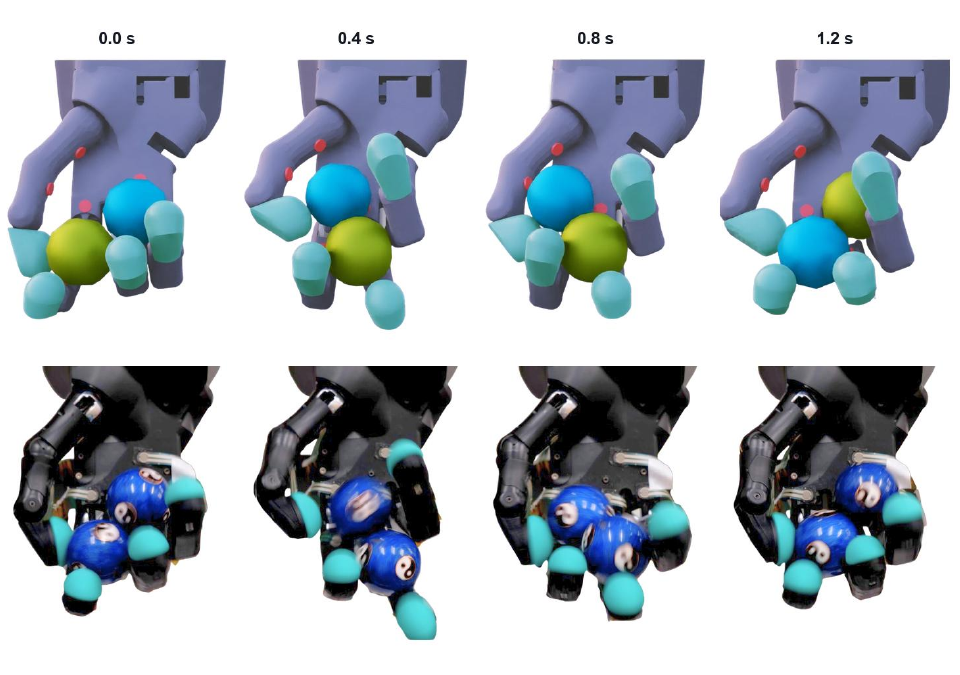
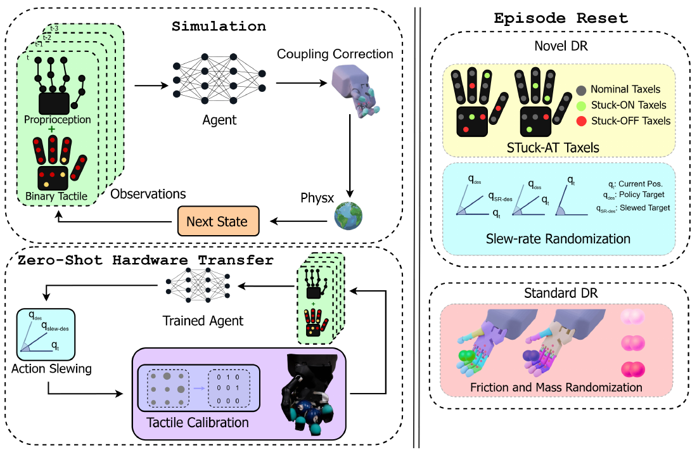

# No Eyes, No Problem: What Does Touch Contribute to Blind Baoding Ball Manipulation?

Code for zero-shot sim-to-real transfer of a **blind** Baoding ball policy to the Shadow Dexterous Hand Lite.
The policy is trained entirely in simulation (Isaac Lab) and deployed without fine-tuning. It observes only
proprioception and **16 binary tactile contacts**: no camera, depth, motion capture, or object state.

On the physical hand, the policy completes **225 consecutive 180° rotations (112.5 full rotations) at ~0.36 rot/s**
in a single continuous trial without dropping a ball.



*A 1.2 s 180° rotation in simulation (top) and on the physical Shadow Hand Lite (bottom) at matched time steps.*

> Paper under review.

---

## Contents
- [Method](#method)
- [Repository layout](#repository-layout)
- [Installation](#installation)
- [Reproducing the paper](#reproducing-the-paper)
  - [Configurations](#configurations)
  - [Training](#training)
  - [Evaluating in simulation](#evaluating-in-simulation)
  - [Deploying to hardware](#deploying-to-hardware)
- [Results](#results)
- [Citation](#citation)
- [Built on RoTO](#built-on-roto)

---

## Method



- **Observation:** four stacked frames, each with 52 proprioceptive values (joint position, joint velocity,
  position error, and previous action for the 13 actuators) plus 16 binary tactile values.
- **Action:** a 13-D joint-position command at 60 Hz.
- **Training:** PPO in Isaac Lab, with 10 s episodes (600 control steps). The reward is the RoTO Baoding reward,
  unchanged.

| Component | What it does | Where |
|---|---|---|
| **Hardware-aligned embodiment** | 12 FSRs (palm and phalanges) + 4 BioTac fingertips as small collision bodies at the physical sensor sites | [`roto/assets/shadow_lite/PAD_POSES.yaml`](roto/assets/shadow_lite/PAD_POSES.yaml), `shadow_padtac_biotac.usd` |
| **Sequential tendon coupling** | Flexion drives PIP until ~100°, then DIP; extension reverses the order. This replaces Isaac Lab's fixed-ratio mimic joint | `_handle_coupled_joints` in [`roto/tasks/roto_env.py`](roto/tasks/roto_env.py) |
| **Physical DR** | Ball mass 45–100 g; ball and per-region hand friction resampled each episode | `_randomize_ball_mass` / `_randomize_ball_friction` in [`roto/tasks/baoding/baoding.py`](roto/tasks/baoding/baoding.py) |
| **SlewDR** (novel) | Limits the per-step change in the command to `s · q̇_max · Δt`, with `s ~ U(0.3, 1.0)` per episode. Hardware uses a fixed `s` | `_apply_cmd_slew` in [`roto/tasks/roto_env.py`](roto/tasks/roto_env.py) |
| **STAT: Stuck-AT Taxels** (novel) | Each episode, `k ~ U{0..6}` of the 12 FSRs are held stuck at 0 or 1 for the whole episode. BioTacs are never corrupted | `_sample_tactile_fsr_corrupt` in [`roto/tasks/robots/shadowlite/shadowlite.py`](roto/tasks/robots/shadowlite/shadowlite.py) |
| **Tactile calibration** | Per-channel hysteresis thresholds fit on the empty hand before deployment. `τ_hi = P99.5 + 5`; `τ_lo = median + 2`, or `τ_hi − 3` when the envelope exceeds 15 ADC counts | [`deploy/deploy_warmup_trial15_zerotac.py`](deploy/deploy_warmup_trial15_zerotac.py) |

> **Observation size in code.** The 16 physical tactile channels are scattered into the 24-slot tactile vector
> shared with the rest of RoTO; the other 8 slots are always 0. The network input is therefore 4 × (52 + 24) = 304-D.
> The paper's 272-D counts only the active channels.

---

## Repository layout

```
roto/
  assets/shadow_lite/        Shadow Hand Lite USD/URDF, FSR pad poses
  tasks/roto_env.py          base env: joint control, sequential coupling, SlewDR
  tasks/robots/shadowlite/   Shadow Lite env, PadTac/PadTac+BT tactile, STAT
  tasks/baoding/             Baoding task, physical DR, C1/C2/C3 env configs
  tasks/baoding/agents/shadowlite/   PPO agent configs (YAML)
scripts/
  train.py  sweep.py  play.py        training, Optuna sweeps, sim playback
  ablate_play.py  ablate_play_tac.py observation-masking ablation harness
  record_policy.py  collect_traj_{sim,hw}.py  sim/hardware trajectory tools
deploy/                      ROS scripts for the physical hand (see below)
fine-tune/                   encoder fine-tuning on hardware data (see FINETUNING.md)
replay_motion_test/          open-loop replay diagnostics, sim vs hardware
```

---

## Installation

Isaac Sim, Isaac Lab, [`multimodal_rl`](https://github.com/elle-miller/multimodal_rl) (the RL agent) and this
repo (the environments) go in one conda environment.

1. Install Isaac Sim and Isaac Lab as
   [pip packages](https://isaac-sim.github.io/IsaacLab/main/source/setup/installation/isaaclab_pip_installation.html).
2. Install `multimodal_rl`:
   ```bash
   git clone https://github.com/elle-miller/multimodal_rl.git
   pip install -e multimodal_rl
   ```
3. Install this repo:
   ```bash
   git clone <this repository> roto
   pip install -e roto
   ```

Hardware deployment additionally needs ROS with the Shadow Hand Lite driver running, plus `pyserial` for the FSR
multiplexer.

---

## Reproducing the paper

All commands run from the repo root. Baoding on the Shadow Hand Lite is selected with `--task Baoding` plus a
`--robot` that picks the randomisation profile.

### Configurations

| Paper | Randomisation | Input | `--robot` | `--agent_cfg` |
|---|---|---|---|---|
| **C1** | Physical | Prop + tactile | `shadowlite_padtac_bt_legacy_frictionmass` | `rl_only_pt_padtac_bt` |
| **C2** | Physical + SlewDR | Prop + tactile | `shadowlite_padtac_bt_legacy_notac` | `rl_only_pt_padtac_bt` |
| **C3 (ours)** | Physical + SlewDR + STAT | Prop + tactile | `shadowlite_padtac_bt_legacy` | `rl_only_pt_padtac_bt` |
| Proprio-only | Physical | Prop only | `shadowlite_padtac_bt_legacy_frictionmass` | `rl_only_pt_padtac_bt_sweep` |
| C3-TacOff | C3 checkpoint | Prop only (tactile zeroed at deployment) | as C3 | as C3, plus `--zero_tactile` |
| Open-loop | – | none (recorded trajectory) | – | [`deploy/deploy_openloop_aug4_trial5.py`](deploy/deploy_openloop_aug4_trial5.py) |

`rl_only_pt_padtac_bt_sweep` keeps the tactile observation slots but zeroes them at the source
(`zero_tactile: true`), so the proprio-only network has the same shape as the tactile ones.

The remaining `--robot` profiles (`_legacy_noslew`, `_legacy_nomassdr`, `_sparse`, `_stuck8`) are extra ablations
not reported in the paper.

#### Checkpoints

The policies deployed on hardware in the paper are in [`checkpoints/`](checkpoints/):

| Paper | Checkpoint | `--robot` / `--agent_cfg` to play it |
|---|---|---|
| C1 | [`checkpoints/c1_physical.pt`](checkpoints/c1_physical.pt) | `shadowlite_padtac_bt_legacy_frictionmass` / `rl_only_pt_padtac_bt` |
| C2 | [`checkpoints/c2_slewdr.pt`](checkpoints/c2_slewdr.pt) | `shadowlite_padtac_bt_legacy_notac` / `rl_only_pt_padtac_bt` |
| C3 (ours), C3-TacOff | [`checkpoints/c3_slewdr_stat.pt`](checkpoints/c3_slewdr_stat.pt) | `shadowlite_padtac_bt_legacy` / `rl_only_pt_padtac_bt` |
| Proprio-only | [`checkpoints/proprio_only.pt`](checkpoints/proprio_only.pt) | `shadowlite_padtac_bt_legacy_frictionmass` / `rl_only_pt_padtac_bt_sweep` |

### Training

The paper trains each configuration for 250 M environment steps on three seeds:

```bash
# C3 (ours)
python scripts/train.py --task Baoding --robot shadowlite_padtac_bt_legacy \
    --agent_cfg rl_only_pt_padtac_bt --num_envs 4096 --headless --seed 1234

# Proprio-only
python scripts/train.py --task Baoding --robot shadowlite_padtac_bt_legacy_frictionmass \
    --agent_cfg rl_only_pt_padtac_bt_sweep --num_envs 4096 --headless --seed 1234
```

Swap `--robot` from the table for C1/C2. `scripts/sweep.py` takes the same arguments plus `--study <name>` for an
Optuna sweep.

### Evaluating in simulation

The paper evaluates each configuration over 768 episodes (256 parallel environments × 3 training seeds):

```bash
python scripts/play.py --task Baoding --robot shadowlite_padtac_bt_legacy \
    --agent_cfg rl_only_pt_padtac_bt --checkpoint checkpoints/c3_slewdr_stat.pt --num_envs 256 --headless

# C3-TacOff: same checkpoint, tactile zeroed
python scripts/play.py ... --zero_tactile
```

`play.py` also writes a `sim_policy_log_seed<seed>.npz` trace (actions, positions, commands, velocities, position
error, tactile). This trace is the sim-side input to the hardware warmup below. For observation-masking ablations
(zeroing or freezing individual proprioceptive blocks, no-ball probes, ball-mass sweeps), see
[`scripts/ablate_play_tac.py`](scripts/ablate_play_tac.py).

### Deploying to hardware

The deploy scripts are ROS nodes for the physical Shadow Hand Lite. They read the 12 FSRs over serial and the 4
BioTacs over ROS. They are **not** argparse-driven: set the constants at the top of each file, then run
`python deploy/<script>.py`. Each module docstring documents its flow.

| Script | Used for | Key settings |
|---|---|---|
| [`deploy_warmup_trial15_zerotac.py`](deploy/deploy_warmup_trial15_zerotac.py) | C1, C2, C3, C3-TacOff | `CHECKPOINT` (e.g. `checkpoints/c3_slewdr_stat.pt`); `SPEED_FRAC` (paper: `s = 0.53`); `ZERO_TACTILE = True` for C3-TacOff |
| [`deploy_policy_simtactile_curlamp.py`](deploy/deploy_policy_simtactile_curlamp.py) | Proprio-only | `CHECKPOINT = checkpoints/proprio_only.pt`; `SPEED_FRAC = 0.65` (paper value) |
| [`deploy_openloop_aug4_trial5.py`](deploy/deploy_openloop_aug4_trial5.py) | Open-loop replay | `REPLAY_FILE` (60 s trajectory recorded from the C3 policy, included) |
| [`fsr_pad_map.py`](deploy/fsr_pad_map.py) | FSR channel map imported by all three | – |

The tactile deploy runs in phases:
1. **Warmup:** replays a sim trajectory with the hand empty. `REPLAY_Q_FILE` is a `play.py` trace.
2. **Calibration:** fits per-channel hysteresis thresholds from that empty-hand envelope.
3. **Positioning:** moves to the start pose and prompts you to place the balls.
4. **Policy:** runs the policy closed-loop at 60 Hz with the slew limit applied.

Hardware protocol used in the paper:
- The hand was tilted ~15° downward from horizontal.
- Default Shadow Hand Lite PD gains were scaled by 0.15, except the index, middle and ring fingers: MCP flexion
  joints were kept at default and MCP abduction joints were scaled by 0.3.
- The same pair of 1.58 in, 55 g balls was used throughout.
- Each configuration ran 10 trials, each until a ball left the hand.

---

## Results

Hardware results are mean ± std over 10 trials. Simulation results cover 768 episodes.

| Condition | Full rotations (HW) | Time-to-drop (s) | η | Speed HW (rot/s) | Speed sim (rot/s) | Drop sim | Drop HW |
|---|---|---|---|---|---|---|---|
| Open-loop | 1.7 ± 1.99 | 6.1 ± 4.7 | – | 0.168 ± 0.179 | – | – | 80% |
| Proprio-only | 4.4 ± 2.44 | 21.4 ± 12.2 | 0.31 ± 0.13 | 0.226 ± 0.098 | 0.591 ± 0.128 | 17% | 20% |
| C3-TacOff | 5.0 ± 4.1 | 19.0 ± 11.2 | 0.58 ± 0.26 | 0.256 ± 0.112 | 0.291 ± 0.167 | 32% | 20% |
| **C3 (ours)** | **34.75 ± 26.06** | **94.8 ± 68.0** | **0.9 ± 0.16** | **0.36 ± 0.061** | 0.416 ± 0.129 | 2% | 10% |
| C1 | 0.35 ± 0.63 | 5.9 ± 4.3 | – | 0.054 ± 0.079 | 0.959 ± 0.071 | 2% | 70% |
| C2 | 0.5 ± 0.53 | 4.1 ± 1.5 | – | 0.101 ± 0.094 | 0.277 ± 0.082 | 9% | 100% |

- **η (exchange efficiency):** the fraction of gait cycles that end in a completed ball exchange.
- **Long-horizon run:** a separate C3 deployment, outside the 10-trial set, completed 112.5 full rotations in 310 s.

---

## Citation

If you use this code, please cite:

```bibtex
@inproceedings{deshmukh_noeyesnoproblem,
  author    = {Deshmukh, Ayush and Agarwal, Nalin and Miller, Elle and Vijayakumar, Sethu},
  title     = {No Eyes, No Problem: What Does Touch Contribute to Blind Baoding Ball Manipulation?},
  booktitle = {},
  year      = {},
}
```

---

## Built on RoTO

This repository extends **RoTO (Robot Tactile Olympiad)**, an RL benchmark for tactile manipulation with
**Find**, **Bounce** and **Baoding** tasks on Franka, Shadow Hand, Shadow Hand Lite, Allegro and ORCA. Those
environments are unchanged and still available:

```bash
python scripts/train.py --task Baoding --robot shadow --agent_cfg forward_dynamics --num_envs 4096 --headless --seed 1234
python scripts/play.py  --task Baoding --num_envs 512 --agent_cfg forward_dynamics_memory \
    --checkpoint readme_assets/checkpoints/baoding_memory.pt
```

- **Configs are passed explicitly.** A task is not tied to one config: agent YAMLs live in
  `roto/tasks/<task>/agents/<robot>/` and are chosen with `--agent_cfg`.
- **Observations** are dictionaries (`prop`, `tactile`, `rgb`, `depth`, `gt`), selected by `obs_list` in the agent
  YAML.
- **Class hierarchy:** `RotoEnv` (a `DirectRLEnv`) → `[Robot]Env` → `[Task]Env`.

If you use this code, please also cite RoTO:

```bibtex
@inproceedings{miller2025tactilerl,
  author    = {Miller, Elle and McInroe, Trevor and Abel, David and Mac Aodha, Oisin and Vijayakumar, Sethu},
  title     = {Enhancing Tactile-based Reinforcement Learning for Robotic Control},
  booktitle = {NeurIPS},
  year      = {2025},
}
```

Licensed under BSD-3 (see [`LICENSE`](LICENSE)).
