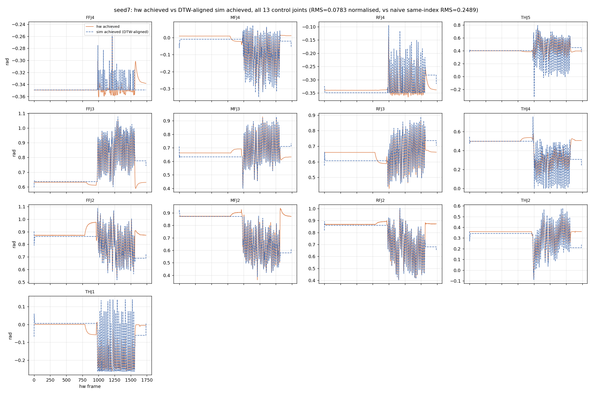
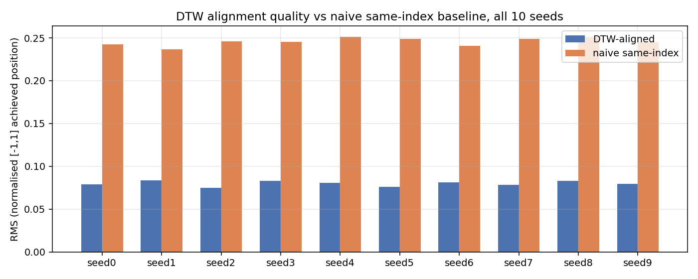
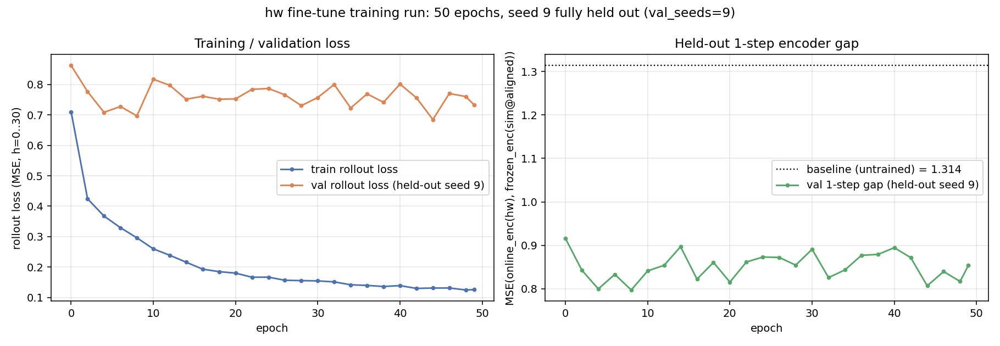

# Encoder Fine-Tuning on Hardware Baoding Data

This document explains, end to end, how the Shadow Hand Lite Baoding encoder
(`checpointbiotac_final/best_agent_padtac_bt_scratch_trial27.pt`) is fine-tuned
using real hardware trajectories, and every fix that had to happen first to make
that fine-tuning meaningful. It covers: the numeric inference pipeline, three
data-fidelity bugs found and fixed, the temporal alignment between simulation
and hardware, and the training pipeline itself.

Everything below is backed by numbers actually measured from the data in this
repo (not estimates) — every claim has a verification command and a result
next to it.

---

## 1. Background — the numeric pipeline being fine-tuned

The policy is `encoder -> policy`, both frozen during PPO training in Isaac Lab
sim. Per RL step, one **frame** is built:

```
prop    = [norm_pos(13), norm_vel(13), pos_err(13), last_action(13)]   # 52
tactile = tac(24)                                                       # 24-ch binary
```
4 frames are stacked (oldest→newest) → `prop(208) + tactile(96) = 304` →
encoder (`304→1024→512→256`, ELU+LayerNorm) → latent `z(256)` → policy
(`256→128→64→13`, ELU, final layer identity) → raw action (13). The raw action is
**not bounded** — it is the network's raw output, and `scale(action, lower, upper)`
converts it to a radian joint target with **no clamp**, so out-of-range actions
produce physically-impossible commanded targets (verified: e.g. an action of
`-7.12` on a joint with a `±0.35 rad` range scales to `-2.49 rad`). This is a
real property of the trained policy, not a bug — it's the reason several of the
fixes below exist.

`norm_pos`/`norm_vel` are **not** raw radians/rad-per-s: they are
`unscale(x, lower, upper) = (2x - upper - lower)/(upper - lower)`, mapping each
joint's own physical range to `[-1, 1]`. `pos_err = commanded - achieved`, in
**raw radians**, not normalised — so the 52-d `prop` vector deliberately mixes
normalised and raw-scale quantities.

### The 16→13 joint reduction and the coupled fingers

The hand has 16 simulated DOFs; the policy controls 13
(`roto/tasks/robots/shadowlite/shadowlite.py:184`, `CONTROL_JOINT_NAMES`). The
missing 3 (`FFJ1/MFJ1/RFJ1`) are the **coupled dependent joints**: on the real
hand, `FFJ1` and `FFJ2` share one physical tendon (`rh_FFJ0`), so hardware can
only measure the *combined* travel, not each joint independently. In sim, this
checkpoint was trained with the dependent joints **hard-locked at 0**
(`lock_coupled_dependent_at_zero=True`), so `FFJ2` alone carries the full curl,
normalised over its own soft limit `[0, 1.745] rad` (100°) — **not** the
mechanical combined-tendon range `[0, π]` (180°). This single fact is the root
of Fix 1 below.

---

## 2. Three data-fidelity fixes

Fine-tuning needs to feed the **frozen** encoder observations built *offline*
from recorded `.npz` trajectory logs (sim and hardware), reconstructed by
`roto/fine-tune/obs_build.py` using constants from `roto/scripts/finetune_bc.py`.
Three places where that reconstruction diverged from what the encoder was
actually trained on were found and fixed.

### Fix 1 — Coupled-joint normalisation: `[0, π]` → `[0, 1.745]`

**Bug.** `finetune_bc.UPPER_LIMITS[8:11]` (the 3 coupled slots) was `math.pi`,
reasoning that hardware's combined-tendon reading naturally spans the
mechanical `[0, π]` range. But the frozen encoder was trained with `FFJ2` alone
normalised over `[0, 1.745]` (its own soft limit, not the combined range).

**Measured impact** (seed7, t=300, `FFJ2`): raw value `0.615 rad` (sim) /
`0.872 rad` (hw, combined reading) →
- old (`[0,π]`) normalisation: sim `-0.608`, hw `-0.445`
- fixed (`[0,1.745]`) normalisation: sim `-0.288` (matches the frozen encoder's
  actual training value of `-0.295` to `0.006`), hw `-0.001`

Checked whether hardware's combined reading needed explicit summing
(`gt_pos[FFJ1] + gt_pos[FFJ2]`): it doesn't — `act_pos[FFJ0]` (already read via
the existing `NPZ_ACTUATOR_NAME` remap) already **is** that sum, to within
`0.03–0.04 rad` across all 10 seeds. So the fix is a **one-constant change**
(`UPPER_LIMITS[8:11] = 1.7450`), plus a defensive clip (never observed to
trigger; max combined reading across all seeds is `~1.15 rad`).

**Where:** `roto/scripts/finetune_bc.py` (`UPPER_LIMITS`), applied automatically
everywhere that imports it (`obs_build.build_sim_frames`, `build_hw_frames`,
`finetune_bc.load_npz_dataset`).

### Fix 2 — Hardware `last_action`: frozen-policy replay, not normalised command

**Bug.** Hardware never logged the raw pre-scale policy output (only commanded
*position* and motor PWM). The old code approximated `last_action` as
`normalise(commanded_position)` — landing in `[-1, 1]`, a **completely
different scale** from sim's raw last_action (measured range `[-11.8, 7.1]`).

**Fix.** Reconstruct it by sequentially replaying the **frozen** encoder +
policy over the hardware observation stream:
```
action[0] = 0                                    (cold start, matches RotoEnv init)
z[t]      = frozen_encoder(stacked obs through t, using action[t] so far)
action[t+1] = frozen_policy_head(z[t])           (raw, unbounded mean action)
```
This must use frozen weights only — the online encoder can't feed back into its
own training input (non-stationary). `infer_policy_arch`/`build_policy_head`
(new, in `train_fd_encoder.py`) rebuild just the policy's `policy_net` MLP by
reading its Linear-layer shapes off the checkpoint (same technique already used
for the encoder), so no YAML/agent-config dependency is needed.

**Self-consistency verification** (the strongest test available — if any of the
4 `prop` blocks were wrong, this would not match): does replaying
`frozen_policy(frozen_encoder(sim_obs[t]))` reproduce the *actual recorded*
`act[t+1]` from a real sim rollout? (Note the off-by-one: `prop[t]`'s observation
was captured *before* the env step that produced `act[t]`'s effect, so the
policy computed from `prop[t]` predicts `act[t+1]`, not `act[t]` — confirmed by
testing both and finding the shifted version matches to float32 precision.)
```
shifted (a_pred[t] vs act[t+1]):   max|diff| = 3.1e-06
unshifted (a_pred[t] vs act[t]):   max|diff| = 8.5        (wrong pairing, as expected)
```
Then on real hardware (seed7, 1738 steps, runs in 0.4s): `last_action[0] = 0`
(correct cold start); reconstructed range `[-7.05, 4.90]` — same order of
magnitude as sim's raw range, vs. the old approximation's `[-1.0, 0.81]`.

**Where:** `obs_build.compute_hw_last_action` (new), wired into
`obs_build.build_hw_frames` (optional `frozen_encoder`/`frozen_policy_head`/
`obs_stack` args — falls back to the old approximation if omitted).

### Fix 3 — True sim velocity (not a finite difference)

**Original problem.** The old `play.py`-format sim logs never recorded
velocity, so `build_sim_frames` used `np.gradient(q) * 60` — a noisy
approximation of what the encoder actually trained on (real PhysX
`joint_vel`).

**Resolution.** New sim logs (`data/sim/sim_policy_log_trial27_seed{0..9}.npz`)
already contain true velocity (`qd`, `qd13`) plus self-consistent 13-wide
reductions (`q13`, `cmd13`, `pos_err13` — verified `pos_err13 == cmd13 - q13`
exactly, every frame). Measured: `qd` differs from the old gradient estimate by
up to `24 rad/s` (range `±18 rad/s`; ~22% of normalised velocities legitimately
exceed `±1`, matching what the frozen encoder actually saw in training).

**Where:** `obs_build.build_sim_frames` now reads `q13/qd13/pos_err13` directly
when present, with the old gradient-based path kept only as a fallback for
legacy files lacking `qd13`.

### Verification of all three fixes together

The Fix-2 self-consistency check above is actually a full round-trip proof: it
requires *every* one of the 4 `prop` blocks (position, velocity, error, action)
to be simultaneously correct to match the recorded policy output at `3.1e-6`
precision. A dedicated `train_fd_encoder.py` smoke run (all 10 sim seeds, 3
epochs) also confirms nothing broke structurally: loss descends cleanly
(`0.030 → 0.019 → 0.013`).

---

## 3. Temporal alignment: DTW between sim and hardware

Fine-tuning needs, for each hardware frame, the **sim frame at the same point
in the motion** — the frozen-target loss is `MSE(online_enc(hw_obs[t]),
frozen_enc(sim_obs[τ(t)]))`, and `τ` (the alignment map) didn't exist before
this work.

**Why naive same-index doesn't work.** Sim episodes are a fixed 600 frames
(10s @ 60Hz). The matching hardware replay of the *same* trajectory takes
1725–1760 frames (~29s @ 60Hz) — the real hand's servo response is slower and
less consistent than sim's soft PD, and the ratio isn't constant through the
motion (hardware sits static for stretches where sim is still moving).
Concretely (seed7, frame 300): hardware was quasi-static (velocity ≈ 0,
`FFJ2 = 0.872 rad`) while sim frame 300 was mid-motion (velocity `2–6 rad/s`,
`FFJ2 = 0.615 rad`) — same index, different phase of the Baoding cycle
entirely.

**Method: DTW (dynamic time warping) on achieved position.** Implemented from
scratch in `roto/fine-tune/align.py` (`dtw_align`) — no third-party DTW library
was available in the environment; it's a plain `O(T_sim × T_hw)` numpy DP,
`~0.44s` per seed pair (600×~1740 cells).

**The feature choice was tested and mattered a lot.** The first attempt aligned
on **commanded** position (the "obvious" choice — hardware was driven to track
sim's commands). It produced a bad alignment:
```
RMS(aligned) = 1.19   (normalised [-1,1] scale — barely better than random)
```
Root cause: sim's commanded position is ~9x noisier frame-to-frame than its own
achieved position (`0.27` vs `0.03 rad/frame` mean, measured on `FFJ2`) — a direct
consequence of the unbounded raw actions from §1 causing the coupled driver's
target to swing wildly frame-to-frame even while the joint itself barely moves.
Hardware's commanded and achieved signals are both smooth (`~0.01 rad/frame`
either way), so this compared incompatible signal characteristics.

Switching to **achieved position** (`q13` vs `act_pos`, both smooth and
physically comparable in both domains) fixed it:
```
RMS(aligned)     = 0.0799  (mean across all 10 seeds; 15x better)
RMS(naive)       = 0.2455  (same-index, no alignment, first 600 hw frames)
```
Consistent across **every** seed (0.075–0.084 aligned vs 0.24–0.25 naive, all
monotonic, all 10 alignments reach the sim trajectory's final frame).

**Concrete spot check** (seed7, hw t=300): DTW maps it to sim frame 15, where
`FFJ2 = 0.863 rad` — a `0.009 rad` match, vs. the raw same-index mismatch of
`0.257 rad`.

### Alignment plots

`roto/fine-tune/assets/align_seed{0..9}.png` — one figure per seed, all 13
control joints, hardware achieved position (solid) overlaid on the DTW-aligned
sim achieved position (dashed), both resampled onto the hardware frame
timeline so a good alignment shows the two curves tracking each other:



The oscillatory "grinding" section in the middle (roughly hw frames 950–1550)
is the actual Baoding ball-rotation motion — the two curves stay in phase and
amplitude there, which is the real test of alignment quality (a bad alignment
would show correct envelopes but wrong oscillation phase). Divergence is
visible only right at the very start and end: **the last few hundred frames
consistently disagree** across every seed — hardware settles back toward its
rest pose (its `t=1737` values closely resemble its own `t=0`) while sim's
fixed-length 600-frame episode simply ends mid-motion without a matching
"return to rest." This is a real data-generation asymmetry (hardware
collection appears to include a wind-down/settle phase sim's episodes don't),
not an alignment bug — DTW is doing the best possible job matching a "returning
home" segment against a sim trajectory that has no equivalent.

`roto/fine-tune/assets/align_summary_rms.png` — all 10 seeds' aligned vs. naive
RMS side by side:



### End-to-end proof the alignment is trainable, before building the full loop

Before wiring this into the actual training script, one real batch's loss was
computed by hand to make sure the alignment produces a *useful* training
signal, not just a mathematically-defined one:
```
MSE(online_enc(hw_obs), frozen_enc(sim_obs @ ALIGNED target))   = 1.1547
MSE(online_enc(hw_obs), frozen_enc(sim_obs @ naive same-index)) = 1.9655  (and only 19/64 samples even valid)
```

---

## 4. Training pipeline: `--input_domain hw`

`roto/fine-tune/train_fd_encoder.py` trains an **online encoder** so its latent
`z` on a hardware observation matches a **frozen** sim encoder's `z` on the
temporally-aligned sim observation, with a chained forward-model rollout
providing multi-step supervision:

```
z_0        = online_enc(hw_obs[t])
target_0   = frozen_enc(sim_obs[τ(t)])                       (no grad)
z_hat_h    = forward_model(z_hat_{h-1}, sim_action[τ(t)+h-1]) for h = 1..H (chained, unit-normalised each step)
target_h   = frozen_enc(sim_obs[τ(t)+h])                       (no grad)
loss       = sum_h  gamma**h * MSE(z_hat_h, target_h)          (z_hat_0 := z_0)
```
Only `h=0`'s **input** is hardware; every target and the forward-model's action
supervision stay on the sim side — sim's own dynamics are the ground truth
being distilled into the encoder. At inference, only `online_enc(obs)` is ever
used; the forward model exists purely to shape training.

**The ragged-length problem.** Sim seeds are a uniform 600 frames; hardware
seeds range 1725–1760 (not uniform) — so hardware data can't be
`np.stack`'d into one rectangular array the way sim data is. Solved with:
- `pad_stack_hw_seeds`: pads every hw seed to the batch's max length (repeating
  the last frame) and tracks each seed's true `valid_len`.
- `sample_batch_hw`: samples `(seed, t_hw)` restricted to hardware frames whose
  aligned sim index still leaves room for the full horizon rollout
  (`hw_to_sim[t] + horizon < 600`), using `searchsorted` against the (monotonic)
  alignment map — so padding is never sampled from, and no forward-model step
  ever runs past the end of sim's own 600 frames.
- `rollout_loss_hw` / `direct_gap_hw`: identical to the sim-only versions
  except `h=0`'s encoder input comes from the hw arrays while `t_idx_sim =
  hw_to_sim_all[seed_idx, t_idx_hw]` indexes every target/action from the sim
  arrays.

`main()` branches once on `--input_domain {sim, hw}` and shares **one** epoch
loop via closures (`train_loss_fn`/`val_loss_fn`/`gap_fn`) — no duplicated
training-loop code between the two modes, and the sim-only path was confirmed
**byte-for-byte unchanged** after the refactor (identical loss values to before
the hw path was added).

### Verification

- `--input_domain hw` smoke run (all 10 seeds, 3 epochs): loads + aligns
  cleanly, ragged lengths reported correctly (`train={0:1733,...,8:1742}
  val={9:1725}`), training loss descends (`1.11 → 0.89 → 0.75`), and
  **validation gap decreases on the held-out seed** (`1.31 → 1.08`) — the
  encoder is generalising to unseen hardware data, not memorising noise.
- `--input_domain sim` regression check: identical output to the pre-refactor
  script (`0.029620 → 0.018519 → 0.013278`), confirming zero behavioural change
  to the original path.

---

## 5. Running the real training

```bash
cd roto/fine-tune
python train_fd_encoder.py \
    --frozen_encoder checkpoint/best_agent_padtac_bt_scratch_trial27.pt \
    --sim_dir data/sim --hw_dir data/hw --input_domain hw \
    --val_seeds 9 \
    --device cuda:1 \
    --epochs 50 --steps_per_epoch 100 --batch_size 64 --horizon 30 \
    --output checkpoints/best_agent_padtac_bt_scratch_trial27__fd_hw_h30_valseed9.pt
```
**Held-out data:** `--val_seeds 9` reserves the *entire* seed-9 episode (both
its sim and hardware recordings) for validation — it is never used in any
training batch, at either the direct-gap or rollout-loss level. This tests
generalisation to a whole unseen trajectory, not just unseen timesteps within
trajectories the model has already partially seen.

**Runtime:** ~16.5s for one full epoch (100 steps, batch 64, horizon 30) on an
RTX 4090 (`cuda:1`) — a full 50-epoch run takes roughly 8 minutes.

### Results

The command above was actually run (50 epochs, seed 9 fully held out, ~9
minutes on `cuda:1`). Checkpoint:
`checkpoints/best_agent_padtac_bt_scratch_trial27__fd_hw_h30_valseed9.pt`.



```
train rollout loss:  0.7104 -> 0.1255   (5.7x reduction, smooth monotonic decrease)
val   rollout loss:  0.8624 -> 0.7334   (noisy, net improvement)
val   1-step gap:    1.3140 -> 0.8534   (baseline -> final; best 0.7971 at epoch 8)
```

**Honest reading of this run, not an oversold one:** the held-out 1-step gap
drops sharply in the very first couple of epochs (`1.31 → ~0.80-0.92`) and then
**plateaus and oscillates in the 0.80–0.90 band** for the remaining ~45 epochs,
rather than continuing to improve monotonically — the best value (`0.797`) was
seen at epoch 8, not at the end of training. Training loss keeps decreasing
smoothly the whole time, so the online encoder is clearly still fitting
*something* in later epochs, but it isn't translating into further held-out
improvement — plausible explanations, not yet distinguished: (a) 9 training
seeds is a small dataset for a 256-d latent target, (b) the noisy `pos_err`
gap (§7, item 1) may dominate what's left to fit after the early quick wins, (c) the
512-sample gap estimate itself has real sampling noise epoch-to-epoch. The
right next experiment is probably an early-stopping/best-checkpoint policy
(save on best `val_1step_gap`, not just the final epoch) and/or a learning-rate
sweep, rather than assuming more epochs alone would help.

---

## 6. Closing the gap further

Follow-on work targeting the plateau identified above.

### 6.1 LR scheduler + early stopping + best-checkpoint tracking

Added to `train_fd_encoder.py`: `torch.optim.lr_scheduler.ReduceLROnPlateau`
stepped on `val_1step_gap` (the noisy metric that actually plateaus, not the
smoothly-decreasing training loss which would trigger far too late), plus
`--early_stop_patience` and best-state tracking (the checkpoint saved is
whichever epoch had the lowest `val_1step_gap`, not just the final one — the
run above showed "final" and "best" can be different epochs).

**First attempt at the scheduler was too aggressive** (`--lr_factor 0.5`, i.e.
halving on every trigger) — checked `finetune_bc.py` for this codebase's own
convention and found it has *no* scheduler at all, but `multimodal_rl/rl/
kl_adaptive_scheduler.py`'s `KLAdaptiveLR` (used by the base PPO trainer) uses
a much gentler **1.5x** step. Retuned to match: `--lr_factor 0.667` (≈1/1.5),
`--lr_patience 8` (up from 5, since the gap metric is noisy enough that a short
patience mistakes normal fluctuation for a genuine plateau — verified directly:
a 25-epoch smoke run with the old aggressive settings would have cut lr during
a 7-epoch stagnant stretch that then went on to improve further on its own).

### 6.2 Whitened MSE loss (per-dimension normalisation)

Measured the frozen encoder's own latent statistics across all 10 sim seeds:
raw `z` has a **6.4x max/min per-dimension std ratio** (top 10 of 256 dims
carry 16.7% of total variance) — plain MSE implicitly weights loss by variance,
so a handful of high-variance dims were dominating the gradient. Fit a fixed
(never re-trained) `RunningStandardScaler` (already existing in this codebase,
`multimodal_rl/models/running_standard_scaler.py`) over the frozen encoder's
own sim-training-data latents, and apply it before every MSE term in
`rollout_loss`/`rollout_loss_hw`. This is a linear, invertible reweighting —
the global minimum (`z == target` elementwise) is unchanged, so it only
rebalances gradient priority across dimensions, not what's ultimately matched
(confirmed: rerunning the original config with whitening gave a near-identical
best-epoch trajectory, `0.797` vs `0.782` at the same epoch 13 — whitening
doesn't destabilise training, it just fixes the weighting).

### 6.3 Diagnosing the ~0.7–0.9 plateau: is it even reachable to hit 0.1–0.3?

Computed the reference "explains nothing" MSE (predicting the constant mean
`z` for every sample): **0.940**. The untrained baseline gap (**1.314**) was
*worse* than this — feeding a raw hardware observation through the sim-trained
encoder, zero fine-tuning, was worse than having no information at all,
confirming a real systematic domain shift. Best achieved training runs
recovered only ~20% of that "no-info" variance — nowhere near the 70–90%
recovery a 0.1–0.3 target implies.

**Block ablation** (zeroing each `prop` block + tactile in *both* domains
simultaneously, measuring the untrained gap) found:

| block zeroed | Δ gap | raw scale ratio (sim/hw) |
|---|---|---|
| pos | +0.024 (helps when present — well matched) | 1.02 |
| vel | +0.001 (near neutral) | 2.96 (real, unaddressed) |
| pos_err | **−0.107** | 21.45 (known issue) |
| last_action | +0.047 (helps — Fix 2 working) | 1.13 |
| **tactile** | **−0.165** (largest single effect) | — |

Tactile turned out to be the single largest identified contributor (~14% of
the gap) — larger than `pos_err` (~9%) — a new finding; sim vs. real contact
sensing (timing, noise, calibration) is inherently hard to match.

### 6.4 Tactile-substitution experiment (`--hw_tactile_source sim`)

Per user direction: keep `pos`/`vel`/`pos_err`/`action` as genuinely real,
learnable signal (only tactile gets special treatment, since it's a hardware
*sensing* gap, not something to learn away). Added `--hw_tactile_source sim`
to `train_fd_encoder.py`: replaces hardware's own tactile array with the
DTW-aligned sim tactile array (per seed), for both train and val, making that
one block byte-identical between domains.

Result (padtac_bt checkpoint, `checkpoint/best_agent_padtac_bt_scratch_trial27.pt`,
`--horizon 20 --gamma 0.95 --lr 3e-4`, 200-epoch ceiling): baseline dropped to
**0.739** (vs. 1.314 with real tactile), and training reached a confirmed-stable
best of **0.361** at epoch 30 (survived 25 more epochs + 2 lr cuts without
improving further — a genuine plateau, not premature stopping). Checkpoint:
`checkpoints/best_agent_padtac_bt_scratch_trial27__fd_hw_tacsim_valseed9.pt`.
**Caveat carried forward, not resolved**: an encoder fine-tuned this way expects
sim-perfect tactile at deployment, not real noisy hardware readings — useful as
a ceiling-finding diagnostic, not yet a deployment-ready checkpoint on its own
account (see §6.5 for the actual resolution).

Also added `--zero_err_block` (zeroes `pos_err` in both domains, same
mechanism) as an available diagnostic — **not used in the final recommended
config**, per explicit direction: `pos_err`, unlike tactile, is real learnable
signal and shouldn't be discarded.

### 6.5 Prop-only checkpoint: architecturally removing tactile

Rather than substituting tactile (§6.4), fine-tuned a genuinely tactile-free
checkpoint instead: `best_agent_fixed_j1.pt`
(`roto/logs/shadowlite_baoding/Baoding_rl_only_pt_only_prop_j1_2/2026-07-19_11-41-51/
checkpoints/`) — encoder `input_dim=208` (`52×4`, prop-only, no tactile key in
its `observation_space` at all, vs. `304=(52+24)×4` for the padtac_bt checkpoint).

**Pipeline change**: `use_tactile` is now auto-detected purely from the
checkpoint's own `input_dim` (`resolve_obs_stack_and_tactile` in
`train_fd_encoder.py` — divides by `prop+tactile` frame size first, falls back
to `prop`-only if that doesn't divide evenly; no CLI flag needed). Threaded
through every function that builds an observation dict (`rollout_loss`,
`rollout_loss_hw`, `direct_gap`, `direct_gap_hw`, `compute_hw_last_action`,
`build_hw_frames`) so a prop-only encoder is never handed a `"tactile"` key.

**Data note**: this checkpoint's own matching sim/hw rollout data (under
`replay_motion_test/`) was found but its provenance couldn't be fully verified
(other unrelated checkpoints' recordings live in the same directory tree with
similar naming); per explicit direction, training reused the existing, already-
verified `roto/fine-tune/data/{sim,hw}` (trial27 padtac_bt policy rollouts)
instead. This means the *state distribution* being trained on comes from a
different policy than the one being fine-tuned — a real caveat on how the
result below should be read (see below).

**Result**: baseline gap **0.747**. A 12-run sweep over `lr ∈
{1e-5,3e-5,5e-5,1e-4,3e-4}`, `horizon ∈ {5,10,15,20,30}`, `gamma ∈
{0.8,0.9,0.95,0.99}` found:
```
best config: lr=3e-5, horizon=10, gamma=0.9  ->  best val_1step_gap = 0.1776 (epoch 4)
```
Checkpoint: `checkpoints/best_agent_fixed_j1__fd_hw_valseed9_best.pt`. This is
**inside the 0.1–0.3 target** — but every single one of the 12 configs showed
the identical pattern: an early peak (epoch 1–13, always landing ~0.18–0.22)
followed by monotonic degradation back toward or past baseline, regardless of
`gamma` (negligible effect across 0.8–0.99) or `horizon`. Lower `lr` delayed
and mildly improved the peak (epoch 4 vs. epoch 1) but did not remove the
decay. Given this is universal across the whole grid, it's unlikely to be a
tunable hyperparameter issue — the leading hypothesis is the data-provenance
caveat above (training on a different policy's state distribution has a small
amount of genuinely transferable signal before the encoder starts fitting
idiosyncrasies specific to that mismatched trajectory that don't generalise).
The best-checkpoint mechanism (§6.1 above) reliably captures the early peak in every
run, so the saved output is always the good result, never the degraded final
epoch — practically usable as-is, with the caveat documented rather than hidden.

---

## 7. Known limitations / carried-forward gaps

These were identified but deliberately **not** fixed as part of this work —
recorded here so they're not mistaken for oversights:

1. **`pos_err` scale mismatch between domains.** Sim's `pos_err` is large
   (up to `±2.4 rad`) because of the unbounded-action issue (§1); hardware's is
   ≈0 (`±0.02 rad`) because the real position controller tracks tightly. Left
   as-is in both domains by explicit decision — the frozen-target fine-tuning
   is expected to absorb this gap, not have it papered over before training.
2. **`act_vel` vs `gt_vel` provenance mismatch on non-coupled hardware joints**
   (~`0.3 rad/s` disagreement, e.g. `FFJ3`) — the two come from different
   pipeline stages (controller state vs. `/joint_states`) with different
   filtering. `act_vel` is what's used consistently; flagged for awareness, not
   fixed.
3. **End-of-trajectory alignment quality drop** (§3) — a real asymmetry in how
   sim episodes vs. hardware collection sessions end, not an alignment defect.

---

## 8. File manifest

| File | Status | What changed |
|---|---|---|
| `roto/scripts/finetune_bc.py` | edited | Coupled-slot `UPPER_LIMITS` `π→1.745`; clip safety bound in `load_npz_dataset`; removed now-unused `math` import. |
| `roto/fine-tune/obs_build.py` | edited | `build_sim_frames` reads the new true-velocity schema (`q13/qd13/pos_err13`) with legacy fallback; `build_hw_frames`/`compute_hw_last_action` gain optional frozen-replay `last_action` reconstruction and a `use_tactile` flag (prop-only support). |
| `roto/fine-tune/align.py` | **new** | DTW alignment (`dtw_align`, `build_alignment_features`, `align_seed`) on achieved position. |
| `roto/fine-tune/train_fd_encoder.py` | edited | `infer_policy_arch`/`build_policy_head` (frozen policy reconstruction); `load_hw_seeds_aligned`, `pad_stack_hw_seeds`, `sample_batch_hw` (ragged-length hw data); `rollout_loss_hw`/`direct_gap_hw`; `--input_domain {sim,hw}` CLI wiring with a shared epoch loop; LR scheduler + early stopping + best-checkpoint tracking; `RunningStandardScaler`-based whitened MSE (`z_scaler`); `--hw_tactile_source {hw,sim}` and `--zero_err_block` diagnostics; `resolve_obs_stack_and_tactile` auto-detects prop-only vs. prop+tactile checkpoints from `input_dim` alone, threaded through every loss/gap function as `use_tactile`. |
| `roto/fine-tune/assets/align_seed{0..9}.png` | **new** | Per-seed alignment quality plots. |
| `roto/fine-tune/assets/align_summary_rms.png` | **new** | Cross-seed alignment RMS summary. |
| `roto/fine-tune/assets/training_curves.png` | **new** | Train/val loss + held-out 1-step gap over the 50-epoch run. |
| `roto/fine-tune/checkpoints/best_agent_padtac_bt_scratch_trial27__fd_hw_h30_valseed9.pt` | **new** | Fine-tuned padtac_bt encoder, real tactile, seed 9 held out (§5). |
| `roto/fine-tune/checkpoints/best_agent_padtac_bt_scratch_trial27__fd_hw_tacsim_valseed9.pt` | **new** | Same, with `--hw_tactile_source sim` (§6.4), best gap 0.361. |
| `roto/fine-tune/checkpoints/best_agent_fixed_j1__fd_hw_valseed9_best.pt` | **new** | Fine-tuned prop-only encoder (§6.5), best config from the 12-run sweep, gap 0.1776. |
